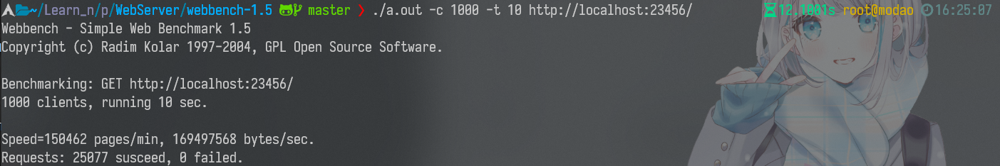
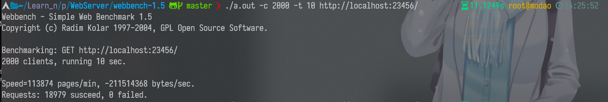
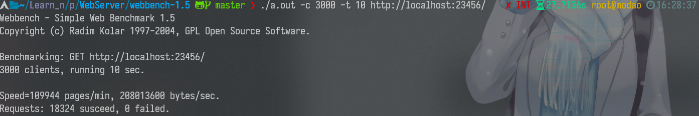
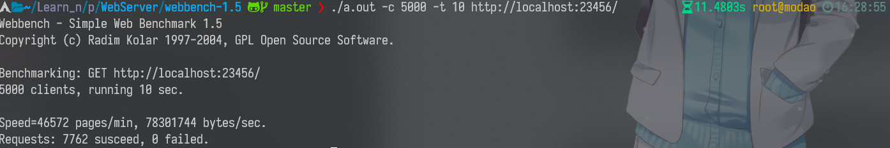

# WebServer

用C++实现的高性能WEB服务器，经过webbenchh压力测试可以实现上万的QPS

## 功能

-   利用IO复用技术Epoll与线程池实现多线程的Reactor高并发模型
-   利用正则与状态机解析HTTP请求报文，实现处理静态资源的请求
-   利用标准库容器封装char，实现自动增长的缓冲区
-   基于小根堆实现的定时器，关闭超时的非活动连接
-   利用Github项目toml11实现服务器配置类，服务器启动时自动读取配置文件
-   利用单例模式与阻塞队列实现异步的日志系统，记录服务器运行状态
-   利用RAII机制实现了数据库连接池，减少数据库连接建立与关闭的开销，同时实现了用户注册登录功能
-   解决URL中有中文时服务器无法找到资源

## 项目环境

+   Linux
+   C++14
+   MariaDB 或 MySQL

## 项目启动

数据库配置：

```mysql
mysql -u root -p modao
create database webserver;
use webserver;
CREATE TABLE user(
    username char(50) NULL,
    password char(50) NULL
)ENGINE=InnoDB;
INSERT INTO user(username, password) VALUES('modao', 'modao');
```

启动服务配置文件：`config.toml`，配置项说明：`/config/config.hpp`中注释

编译：make

运行：`./server`

## 项目目录

main.cc：

+   初始化配置类config，读取config.toml
+   初始化WebServer类，调用Start()运行服务

WebServer.cc：

+   构造函数：
    +   首次初始化，RAII：
        +   计时器
        +   日志
        +   线程池
        +   MySql代理池
        +   epoller：封装epoll
    +   设置epoll事件触发模式
        +   监听套接字触发模式
        +   连接套接字触发模式
    +   初始化监听套接字
        +   设置关闭选项
        +   设置端口复用选项
        +   将监听套接字添加到epoller事件队列中
        +   设置监听套接字非阻塞

+   Start()：对事件触发的套接字进行处理

heaptime.cc：使用最小堆管理连接有效存活时间

+   对外接口：
    +   add()：为fd添加计时器
    +   GetNextTick()：得到下一个即将过期的计时器结点的剩余存活时间，让epoller等待（wait）对应时间
    +   adjust()：对事件到来的fd刷新计时器

threadpool.hpp：

+   构造函数：创建max个线程，线程中对线程池中的任务task进行轮询，当线程池的关闭选项is_closed有效时，线程退出
+   线程池销毁时，调用析构函数，将is_closed置为true
+   对外接口：AddTask()，将任务函数添加到pool中

log.cc：

+   初始化：
    +   设置最低日志等级
    +   日志存放路径
    +   异步队列长度（大于0，设is_async为true）
        +   初始化deque_，存放日志数据
        +   初始化write_thread_线程，异步线程，负责将日志缓存写到日志文件里
    +   按日期创建日志文件，将fp_指向打开的日志文件

+   写日志write()：
    +   将日志内容放到缓冲区buff_中
    +   异步，将缓冲区中的日志内容放到deque_；同步，将缓冲区中的日志内容写到文件描述符

+   对外接口：通过宏封装的write()

httpconn.cc：连接的抽象类，由webserver使用

+   request内容从fd被读到的read_buff_缓冲区，由http_request对象解析
+   response头部存在write_buff（iov[0]）中，文件内容存放到iov[1]中，将response内容从iov写到fd中

buffer.cc：读写复用、可扩容缓冲区

## 压力测试

虚拟机配置：

+   ArchLinux
+   Intel i5-7300HQ（使用2核）
+   4G内存

QPS：1000左右









## 参考项目

[C++ Linux WebServer服务器](https://github.com/markparticle/WebServer)

[TinyWebServer](https://github.com/qinguoyi/TinyWebServer)
